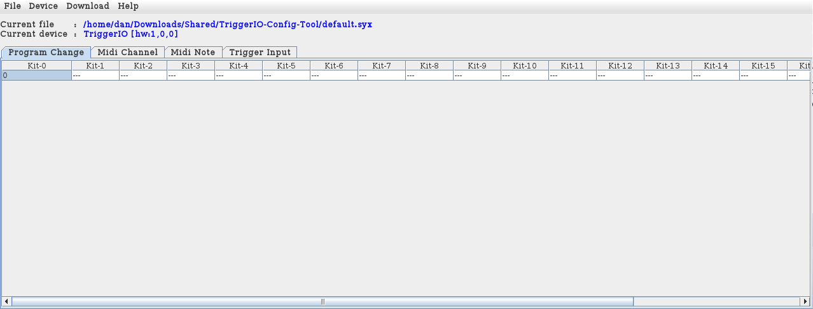
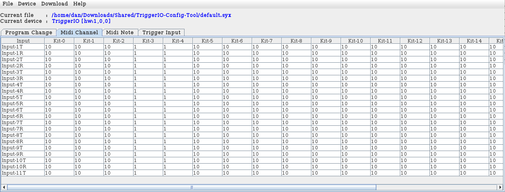
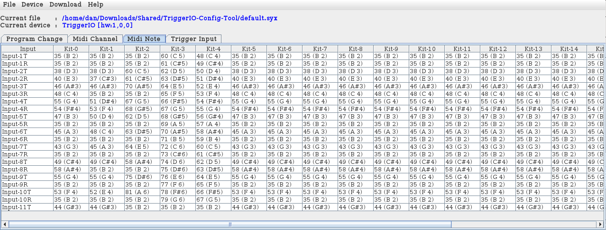
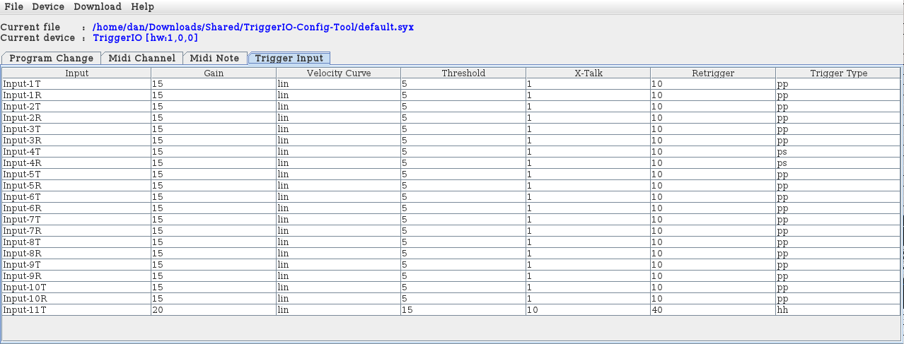

# TriggerIO Configuration Tool
The TriggerIO Configuration tool is an application for configuring the Alesis TriggerIO midi drum trigger.

At present TriggerIO Configuration Tool is very basic but does perform all of the functions that can be carried out directly on the Alesis device.

## Program Change

## Midi Channel

## Midi Notes

## Trigger Inputs
The Trigger Input names can be edited here.

